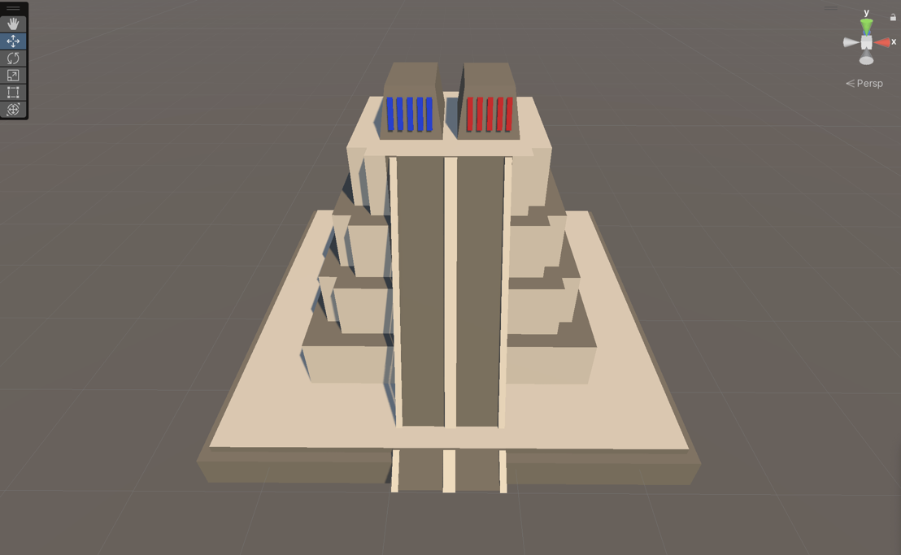
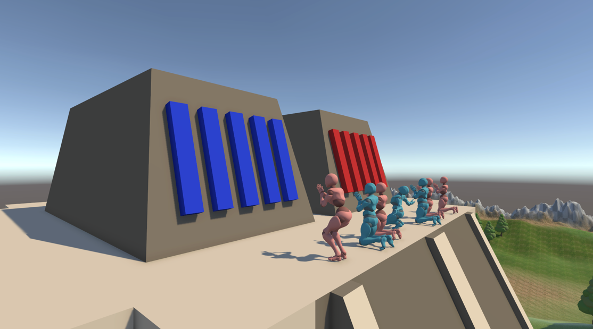
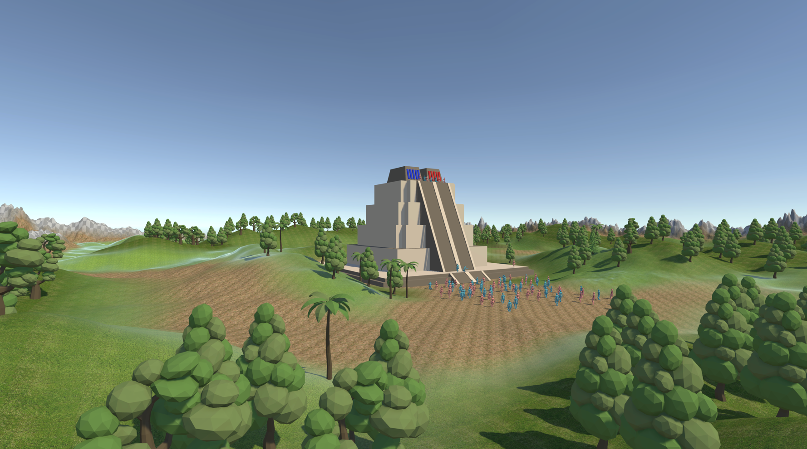

Viva Mexico
---
Creadores: Luis Velazquez, Edward Garcia y Bryan Guevara

Para el proceso de hacer el templo Azteca utilizamos Probuilder para hacer las estructuras y los materiales, y para hacer el terreno utilizamos el terreno de Unity y lo modificamos con el pincel de terreno. El templo se utilizo materiales para derle el color y tambien utilizamos referencias para saber un poco mas sobre como se veian los templos aztecas.

Para el terreno se utiliza el terrain de unity y se le da forma con el pincel de terreno y se le agrega un material para darle color y textura.
Utilizamos unos assest de unity para los arboles para tener un ambiente mas natural.

Las personas se sacaron de la pagina de Mixamo. Escojimos varias de las figuras de diferentes posiciones y creamos un conjunto de personas en el fondo para para darle un poco de vida al templo

Dentro de todo creo que el conjunto de assest y un poco de creatividad se logró mucho para el proyecto. Se logró un ambiente natural y un templo azteca que se ve muy bien. Se logró un ambiente natural y un templo azteca que se ve muy bien. Se logró un ambiente natural y un templo azteca que se ve muy bien. 

Historia del Templo Azteca Video juego
---
En un tiempo remoto, existió una leyenda sobre una pareja legendaria: Lah y Lau. Lah, con su aspecto imponente y ojos oscuros como el mar, y Lau, de estatura pequeña pero ojos rojos como el sol. Juntos, brindaron su ayuda a la humanidad en momentos de necesidad, enseñando sabiduría y manipulación de la naturaleza para sobrevivir y prosperar en equilibrio.

Sin embargo, con el paso del tiempo, los humanos perdieron interés en la sabiduría de Lah y se volcaron hacia las enseñanzas prácticas de Lau. Esto enfureció a Lah, quien se retiró y lloró hasta volverse gris, desilusionado con la humanidad. El desequilibrio resultante llevó a la sociedad al borde de la destrucción.

Lau, consciente de la importancia del equilibrio, intentó negociar con Lah, pero falló. La humanidad, desesperada, atacó y mató a Lah frente a Lau. Enfurecido, Lau se transformó en una fuerza destructiva y vengativa, mostrando a los humanos el error de depender solo de la fuerza y la supervivencia. Tras un enfrentamiento, los humanos se rindieron y prometieron mantener el equilibrio, construyendo un templo en honor a Lah y rogándole que no regrese.

Así, la leyenda de Lah y Lau se convirtió en un recordatorio de la necesidad de mantener el equilibrio entre la sabiduría y la fuerza, y de las consecuencias trágicas que pueden surgir cuando se pierde este equilibrio. El templo se convirtió en un símbolo de respeto por el balance y una advertencia para recordar que la humanidad debe buscar la armonía en todas sus acciones.

Referencias
---
Referencias para el templo azteca (Pagina super interesante)
https://tenochtitlan.thomaskole.nl/

